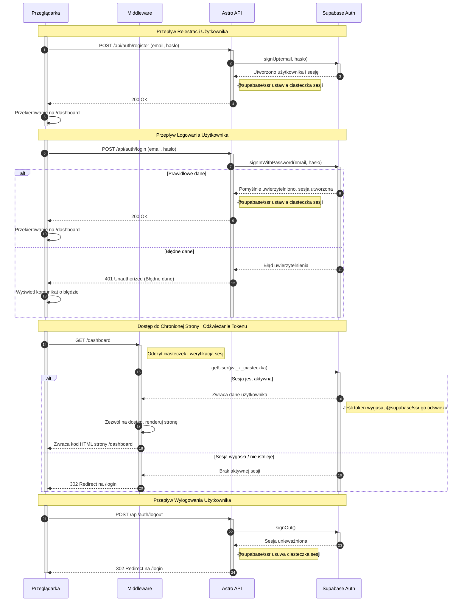

<authentication_analysis>
1.  **Przepływy autentykacji:**
    *   **Rejestracja użytkownika:** Nowy użytkownik zakłada konto za pomocą adresu e-mail i hasła. Po pomyślnej rejestracji jest automatycznie logowany i przekierowywany do panelu głównego.
    *   **Logowanie użytkownika:** Zarejestrowany użytkownik loguje się, podając e-mail i hasło. Po pomyślnym zalogowaniu uzyskuje dostęp do chronionych zasobów. W przypadku niepowodzenia otrzymuje komunikat o błędzie.
    *   **Dostęp do chronionych zasobów:** System weryfikuje, czy użytkownik ma aktywną sesję przy każdej próbie dostępu do chronionej strony. Jeśli sesja jest nieważna, użytkownik jest przekierowywany na stronę logowania.
    *   **Wylogowanie:** Użytkownik kończy swoją sesję, co powoduje unieważnienie tokenów i usunięcie ciasteczek sesyjnych.
    *   **Odzyskiwanie hasła:** Użytkownik może zainicjować proces resetowania hasła poprzez e-mail.

2.  **Główni aktorzy i ich interakcje:**
    *   **Przeglądarka:** Interfejs użytkownika, z którym wchodzi w interakcję użytkownik. Renderuje formularze (React) i wysyła żądania do backendu.
    *   **Middleware (Astro):** Pośrednik po stronie serwera, który przechwytuje wszystkie żądania. Odpowiada za weryfikację sesji użytkownika przed udzieleniem dostępu do chronionych stron.
    *   **Astro API:** Punkty końcowe backendu, które obsługują logikę biznesową: rejestrację, logowanie, wylogowanie itp. Komunikują się z Supabase Auth.
    *   **Supabase Auth:** Zewnętrzna usługa odpowiedzialna za zarządzanie użytkownikami, sesjami i tokenami JWT.

3.  **Procesy weryfikacji i odświeżania tokenów:**
    *   **Weryfikacja:** Middleware przy każdym żądaniu do chronionej trasy odczytuje tokeny JWT z ciasteczek `HttpOnly` i weryfikuje ich ważność za pomocą serwerowego klienta Supabase (`@supabase/ssr`).
    *   **Odświeżanie:** Biblioteka `@supabase/ssr` automatycznie zarządza odświeżaniem tokenów. Gdy Middleware weryfikuje sesję, a token dostępowy (access token) jest bliski wygaśnięcia, biblioteka używa tokenu odświeżającego (refresh token) do uzyskania nowego tokenu dostępowego od Supabase Auth, zapewniając ciągłość sesji bez przerywania pracy użytkownika.

4.  **Opis kroków autentykacji:**
    *   **Rejestracja/Logowanie:** Użytkownik podaje dane w formularzu. Przeglądarka wysyła je do `Astro API`. API woła odpowiednią metodę `Supabase Auth`. Jeśli operacja się powiedzie, Supabase generuje tokeny JWT, a serwer (`@supabase/ssr`) ustawia je w ciasteczkach w odpowiedzi do przeglądarki.
    *   **Dostęp do strony:** Przeglądarka wysyła żądanie. `Middleware` sprawdza ciasteczka. Jeśli sesja jest ważna (tokeny są poprawne i niewygasłe), żądanie jest przepuszczane. Jeśli nie, następuje przekierowanie do strony logowania.
    *   **Wylogowanie:** Przeglądarka wysyła żądanie do `Astro API`. API wywołuje metodę wylogowania w `Supabase Auth`, a serwer usuwa ciasteczka sesyjne.
</authentication_analysis>

<mermaid_diagram>

</mermaid_diagram>
